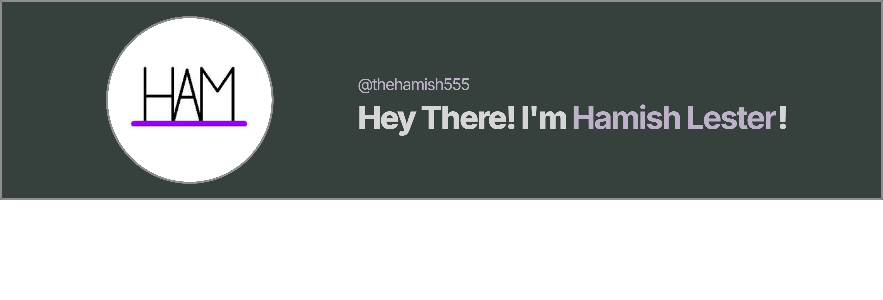

<!-- Banner Image -->

  

<!-- Typing Animation -->
<h1 align="center">
  
</h1>

---

## 🚀 About Me

- 🎓 **Self-taught programmer** and **Software Engineering major**.
- 🛠️ Passionate about creating **games**, **bots**, and **useful tools**.
- 🌎 Always curious to explore **new technologies** and **improve problem-solving skills**.
- ⚡ Fun fact: I love blending creativity with technology to make exciting things happen!

---

## 🛠️ Languages & Tools

  
  
  
  
  
  
  

---

## 📚 Skills & Projects

<strong>🐍 Python</strong>

- Developed games like **UNO**, **Snake**, **Connect 4**, and **Tic-Tac-Toe**.
- Built **Discord bots** integrated with web apps.
- Created robotics interfaces and data analysis systems.
- Designed educational tools like **Chess Tutorials** and **Numeracy Helpers**.

<strong>☕ Java</strong>

- Developed **Minecraft Mods** and **academic projects** focused on **OOP** and **design principles**.

<strong>💻 C, C++, C#</strong>

- Worked on a range of **university projects** involving systems programming, object-oriented programming, and application development.

<strong>🛠️ Other Tools</strong>

- Familiar with **Git** version control and backend development workflows.

---

## 📈 GitHub Stats

  
  

  

---

## 📫 Contact Me

  
  

---

  

 
